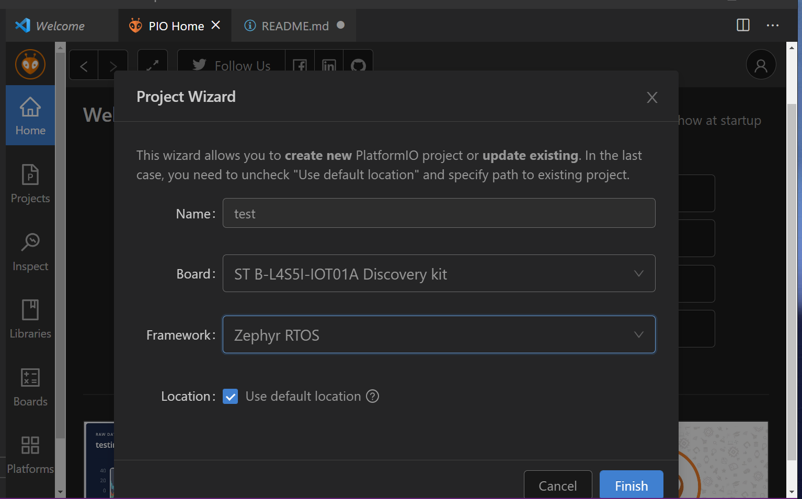

# IoT-United

This Repo is for the 2021 VIP IoT United

## Zephyr Set Up
1. Install VSCODE
2. Get PlatformIOIDE from Extensions of VSCODE
3. Install ST STM32 at PlatformIOIDE->Platforms->Embedded.
4. After installation, copy json file to User/<Username>/.platformio/platforms/ststm32/boards
5. Create a New project and follow 
    
    NOTE!!!! PLEASE WAIT FOR THE NEW PROJECT TO FINISH CREATE!!!

## Project Structure

### Assets

### MiddleStation

### PCB Design

### Cloud

### GUI Application

### Functionality Tests
